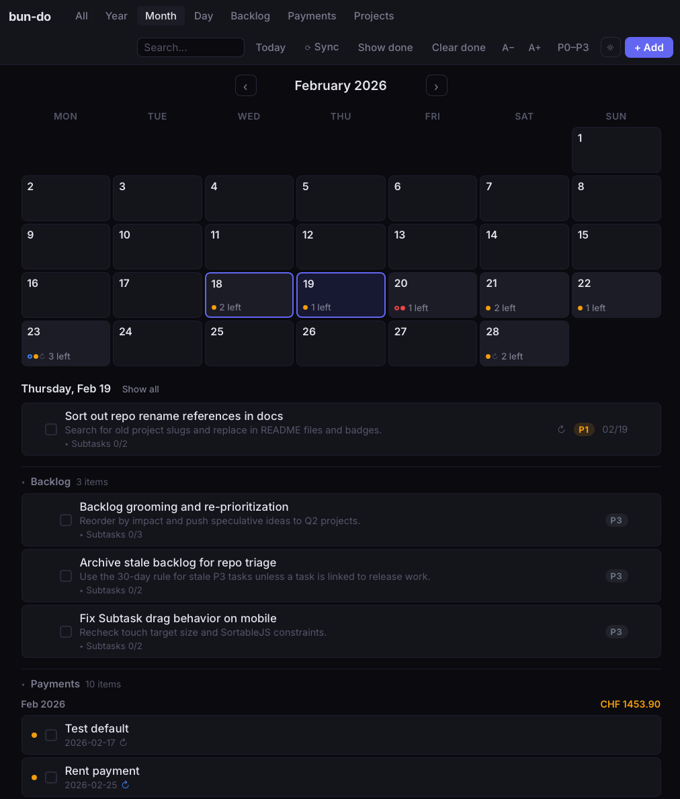

# bun-do

A fast, local-first todo app built on [Bun](https://bun.sh). One TypeScript file, one HTML file, zero runtime dependencies. Built to be used and controlled by AI agents.




## Why bun-do?

Most todo apps want you to sign up, sync to the cloud, or install an Electron app. **bun-do** is different:

- **Single-file server** — `server.ts` serves both the API and frontend
- **JSON storage** — tasks and projects live in plain `.json` files you can version, grep, or edit by hand
- **No build step** — Alpine.js + SortableJS vendored locally, works offline
- **Self-hosted** — runs on `localhost`, your data never leaves your machine
- **AI-native** — ships with an MCP server and installable skill for Claude Code and [OpenClaw](https://github.com/openclaw/openclaw)

## Features

**Views** — All / Year / Month / Day / Backlog / Payments / Projects

**Tasks**
- Priorities P0 (critical) through P3 (backlog), with optional Eisenhower matrix labels
- Types: task, deadline, reminder, payment
- Recurring: weekly, monthly, yearly with auto-creation on completion
- Overdue tasks auto-carry to today (payments keep their original due date)
- Inline click-to-edit for titles, notes, and subtask names
- Undo delete with 10-second recovery window

**Payments** — Dedicated bill/payment tracker with optional amounts, grouped by month with per-month subtotals

**Subtasks** — Per-task checklists with drag-and-drop reorder

**Projects** — Lightweight project tracker with timestamped progress log entries

**UX**
- Keyboard shortcuts: `n` new task, `1`–`5` switch views, `/` search, `Esc` dismiss
- Live search across task titles and notes
- Overdue count badge
- Adjustable font size (A-/A+)
- Error toasts on failed API calls
- Light / dark theme

## Quick start (npm)

```bash
bun install -g bun-do
bun-do          # start server + print URL
bun-do open     # start server + open in browser
```

Data is stored in `~/.bun-do`.

### Service manager commands

```bash
bun-do start     # start background server (default)
bun-do stop      # stop background server
bun-do restart   # restart background server
bun-do status    # check running state
bun-do open      # start + open in browser
bun-do --version # print version
```

Custom port:

```bash
bun-do start --port=9000
```

### Run without installing

```bash
bunx bun-do
```

## Quick start (source)

```bash
git clone https://github.com/ricardofrantz/bun-do.git
cd bun-do
bun install
bun run dev     # hot reload on :8000
```

Or without hot reload:

```bash
bun run start   # plain server on :8000
```

### Background service (source clone)

```bash
./bin/bun-do              # start
./bin/bun-do status       # check
./bin/bun-do stop         # stop
./bin/bun-do restart      # restart
./bin/bun-do restart --example  # restart and reload data/tasks.example.json
```

## macOS app (optional)

```bash
./bin/bun-do.app start    # start backend + open app window
./bin/bun-do.app stop     # stop backend
./bin/bun-do.app status   # check running state
./bin/bun-do.app restart  # restart backend
```

The app uses the same backend and storage (`BUNDO_DATA_DIR`), so browser and macOS modes share data.

## LLM Integration

bun-do is designed to be your AI agent's task layer. It ships with two integration paths so any LLM stack can read, add, edit, and delete your tasks.

### OpenClaw (recommended)

[OpenClaw](https://github.com/openclaw/openclaw) is a local-first personal AI assistant that routes your conversations from WhatsApp, Telegram, Slack, Discord, and more to Claude or any LLM — all running on your own machine.

bun-do + OpenClaw = text your AI from anywhere and manage your tasks without leaving your messages.

```
You (WhatsApp) → "add P1 task: fix the deployment, due tomorrow"
OpenClaw → bun-do skill → POST /api/tasks
OpenClaw → "Done. Task added for Feb 19."
```

Install the skill for OpenClaw:

```bash
bun-do install-skill --openclaw
# copies to ~/.openclaw/workspace/skills/bun-do-api/SKILL.md
```

Restart OpenClaw to activate.

### Claude Code / Claude Desktop

```bash
bun-do install-skill
# copies to ~/.claude/skills/bun-do-api/SKILL.md
```

Restart Claude Code or start a new session. Claude can now add, edit, and list tasks
directly via the REST API using `curl`.

### MCP server (any MCP client)

`bun-do-mcp` is a stdio MCP server exposing 6 tools:
`list_tasks`, `add_task`, `update_task`, `delete_task`, `list_projects`, `add_project_entry`.

Add to `.mcp.json` or `claude_desktop_config.json`:

```json
{
  "mcpServers": {
    "bun-do": { "command": "bun-do-mcp" }
  }
}
```

Custom port: `"env": { "BUNDO_PORT": "9000" }`. Run `bun-do start` first.

## Configuration

| Variable | Default | Description |
|---|---|---|
| `BUNDO_DATA_DIR` | `./data` (source) / `~/.bun-do` (npm) | Directory for JSON data files |

To use a custom data directory:

```bash
export BUNDO_DATA_DIR=~/my-tasks
bun-do restart
```

## Data

All data is plain JSON in `BUNDO_DATA_DIR`:

```
data/
  tasks.json            # your tasks
  projects.json         # your projects
  tasks.example.json    # seed data (committed to repo)
```

On first run, `tasks.example.json` seeds `tasks.json` if it doesn't exist.

## API

| Method | Endpoint | Description |
|---|---|---|
| `GET` | `/api/tasks` | List tasks (auto-carries overdue to today) |
| `POST` | `/api/tasks` | Create task |
| `PUT` | `/api/tasks/:id` | Update task |
| `DELETE` | `/api/tasks/:id` | Delete task |
| `POST` | `/api/tasks/reorder` | Persist backlog order |
| `POST` | `/api/tasks/clear-done` | Remove completed tasks |
| `POST` | `/api/tasks/:id/subtasks` | Add subtask |
| `PUT` | `/api/tasks/:id/subtasks/:sid` | Update subtask |
| `DELETE` | `/api/tasks/:id/subtasks/:sid` | Delete subtask |
| `POST` | `/api/tasks/:id/subtasks/reorder` | Reorder subtasks |
| `GET` | `/api/projects` | List projects |
| `POST` | `/api/projects` | Create project |
| `PUT` | `/api/projects/:id` | Update project |
| `DELETE` | `/api/projects/:id` | Delete project |
| `POST` | `/api/projects/:id/entries` | Add log entry |
| `DELETE` | `/api/projects/:id/entries/:eid` | Delete log entry |

## Stack

| Layer | Tech |
|---|---|
| Runtime | [Bun](https://bun.sh) |
| Server | `Bun.serve()` — zero-dependency HTTP |
| Frontend | [Alpine.js](https://alpinejs.dev) + [SortableJS](https://sortablejs.github.io/Sortable/) (vendored) |
| Storage | Flat JSON files |

## License

BSD-3-Clause
